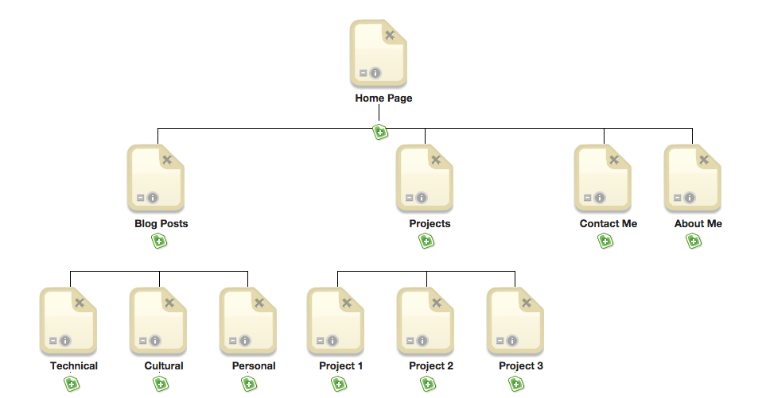

## 2. Site Planning Reflection

*Remember, reflections should only take about 10-15 minutes.*

### Site planning

1. What is your site's primary goal or purpose?
>> The primary purpose of my website will be to share my progress and projects with others, hopefully to get feedback.
2. What kind of content will your site feature?
>> There will be 3 main content categories on my web site. My blog posts, projects, and links to my online social media.
3. What is the best way to share that content with users?
>> Good Questionnnnnn
4. Think about your target audience. What are their interests and how do you see your site addressing them?
>> My target audience for this will be fellow DBC students and any friends/family wishing to keep track of my progress.
5. How do you think most users will find your site?
>> Most users will find my site form my twitter posts.
6. What is the primary "action" the user should take when coming to your site? Do you want them to search for information, contact you, or see your portfolio? It's ok to have several actions at once, or different actions for different kinds of visitors.
>> I want the primary action to be contacting me (either by email or twitter) to give feedback, suggestions, but also to go follow my other links.

***

### Site map

Your site map:

- **What did you learn about design and user experience?** The very first things you should think about when designing is how you want some to interact with your project. Usually when I think about design, I think about aesthetics, not usability.
- **Do you like design and user experience? Was it fun planning your site and creating a site map? (If you hated it, that's OK too)** I didn't hate it, but like I mentioned, I tend to think more visually and aesthetically, so planning something that was so blank and wittled down was a different experience for me. I think I'll enjoy the next steps more.
- **What questions did you ask during this challenge? What resources did you find to help you answer them?** My biggest problem was actually getting the wireframe images to show up inline using markdown. I've gone to at least 6 sites already and still haven't figured it out.
- **What concepts are you having trouble with, or did you just figure something out? If so, what?** I wouldn't say I had trouble with, but I was uncomfortable with building the wireframe for a blog that I don't really know much about. I know we will be posting our assignements and projects there later, but I don't have much information on those, so it's hard to know how I will want the lay out.
- **How confident are you with each of the Learning Competencies for this challenge?** I'm pretty confident. I've taken design thinking bootcamp before and I thought this touched a lot on those subjects.
- **Which parts of the challenge did you enjoy?** I enjoyed actually putting things down visually for the site map.
- **Which parts of the challenge did you find tedious?** Trying to figure out how I wanted to build my blog when I don't really see the clear objective of it. I think this would have been easier for me had it been a project for an organization or anything else.

