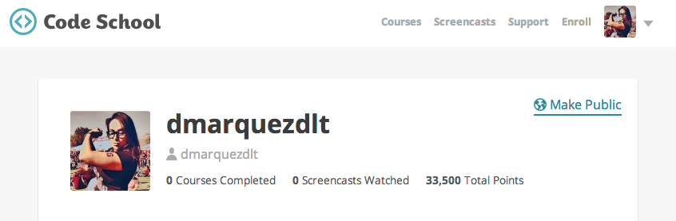
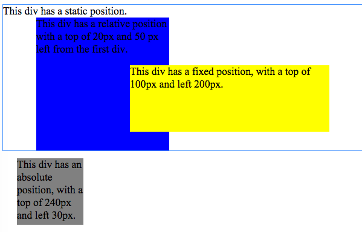
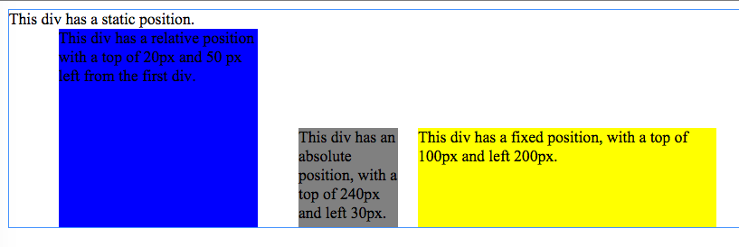
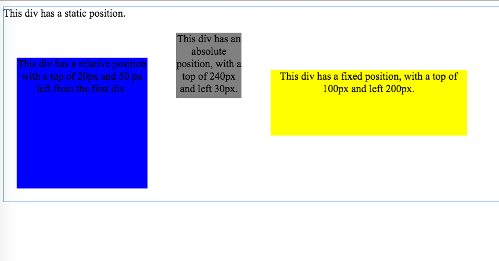
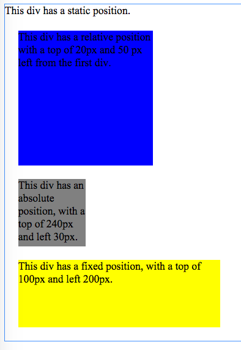
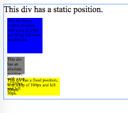
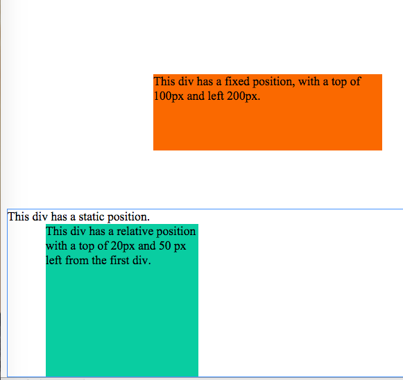
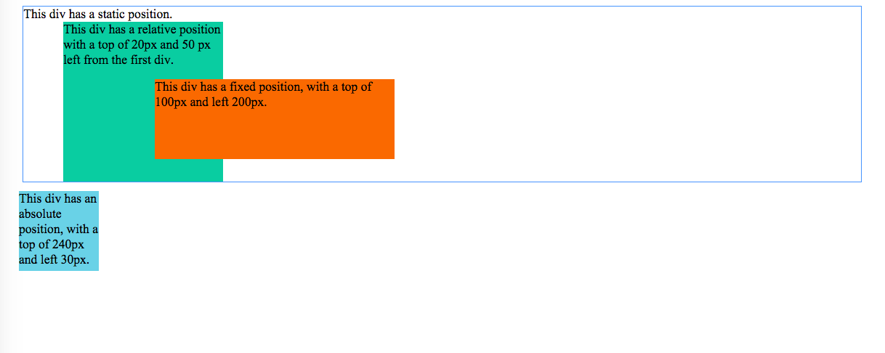
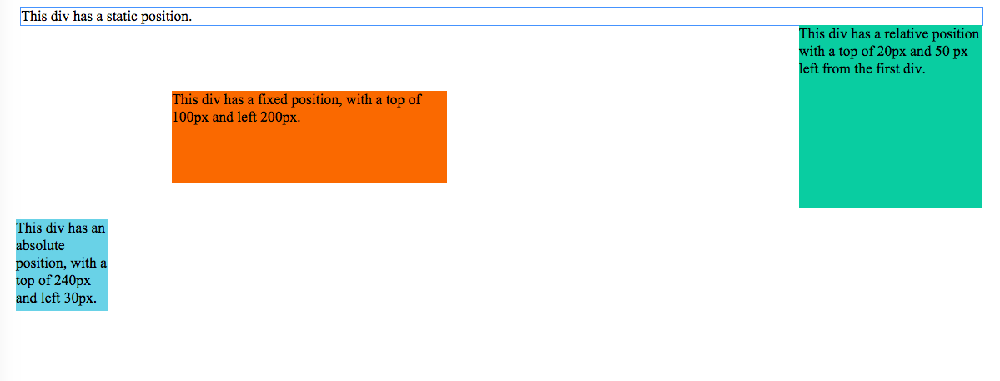
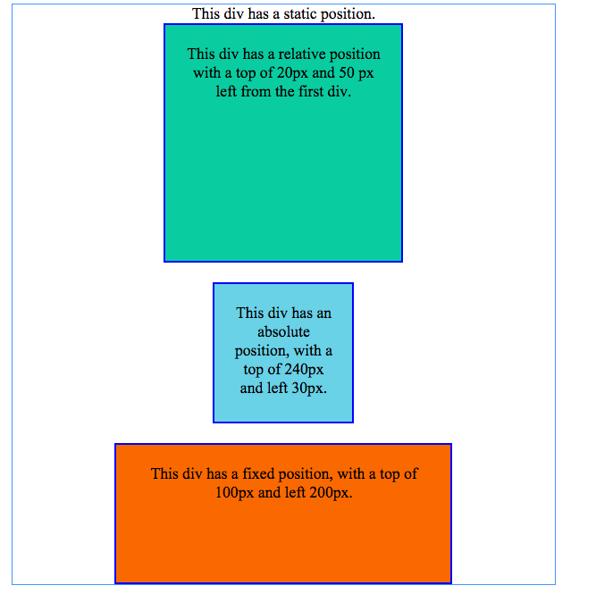

# 7. Chrome Dev Tools Challenge Reflection

## Release 1: Chrome Dev Tools

## Release 2: Positioning

- New Colors:

- Boxes in a row

- Make the boxes have equal distance between them

- Move all the boxes into one column

- Resize the boxes so they are 30% of their original size

- Make the static div go to the bottom and have an absolute positiion (no matter what, it should always be at the bottom of the page - but not in the browser window) Make the footer 100% the width of the screen

- Make the absolute div a header at the top of the page with a fixed position so it's always at the top of the browser window. Make the width 95% of the entire screen and centered

- Move the relative div position to the right so it's like a right sidebar.

- Make a configuration that plays with margin, border, and padding. See if you can find a quick way to explain that to yourself.

- Make a configuration that uses block and inline-block to see what the differences are

## Release 3: Reflection
* **Describe the Document Object Model. What about it makes sense to you? What doesn't? What seems good and bad about it?** The DOM is a structure that connects web pages to scripts/programming languages. It is beginning to make more sense to me now that I've visualized it as a hierarchy tree, where a developer to manipulate the tree's elements using a programming language. I know that the DOM is what allows pages to be dynamic, but I am still unclear how to do it exactly.
* **Did you find Chrome Web Tools fun, helpful, or a pain to work with?** I found it to be a lot of fun.  I really liked experimenting with the tools. I visited some of my favorite pages and used to the tools just so I can start learning what is behind pages I like.
Of course there was LOTS I didn't understand, but it was still a learning experience. My favorite part was being able to edit their HTML/CSS and play with the pages.
* **Did you have an "aha" moments or were any concepts solidified?** Yea, I learn best by doing. When I was watching the videos, there were some things I was confused by. The quizzes at the end of each video really solidified the content. The Element and Source tabs felt intuitive after a while. Once I started playing with it and then went back to watch the video, it made a lot more sense.

